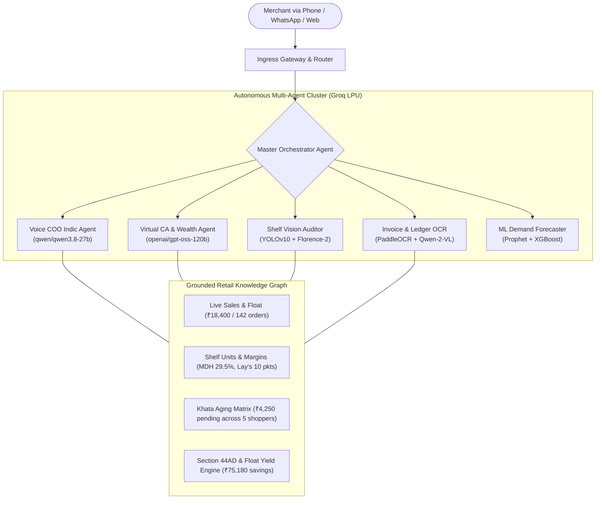

# 📑 DukaanPay AI — Technical Approach & Architecture Whitepaper

> **Track 01: Merchant Growth AI** · Paytm Build for India AI Hackathon  
> **Team Sentinels**: Mayank Yadav & Akshat Arya  
> **Repository**: [github.com/beastzex/DukaanPayAI_Paytm_Hackathon](https://github.com/beastzex/DukaanPayAI_Paytm_Hackathon)  
> **Live Production URL**: [https://dukaanpayai-paytm-hackathon.onrender.com](https://dukaanpayai-paytm-hackathon.onrender.com)  
> **Video Demonstration**: [Google Drive Video Folder](https://drive.google.com/drive/folders/1Kgnw95GOTJ4w2EmcUGzdjWV706LuykhY)  

---

## 1. Executive Context & The Bharat Retail Reality

Over **13 million Kirana (corner retail) stores** form the bedrock of India's consumer goods supply chain, handling **85%+ of grocery and FMCG sales**. While Paytm successfully digitized payments via QR codes and pioneered the 4G Soundbox, the merchant's core business workflows remain archaic:

1. **Counter Chaos & Lack of Time**: During peak morning (07:30 - 10:00 AM) and evening (06:00 - 08:30 PM) rushes, a single shopkeeper serves 1 customer every 60-90 seconds. They have zero bandwidth to open software like Vyapar, Khatabook, or Marg ERP to type inventory items or debts.
2. **Uncollected Credit Leakage (Khata)**: An average store carries ₹4,000 to ₹15,000 in uncollected informal customer credit across dozens of neighbors. Because manual reminders feel socially awkward and tracking is scattered across paper registers, up to 12% of credit becomes bad debt.
3. **Distributor Price Creeping**: FMCG distributors frequently raise wholesale invoice rates by 3% - 7% without explicit merchant agreement. Unaudited paper bills result in hidden margin shrinkage.
4. **Statutory Tax & Wealth Blindspots**: Most Kirana merchants pay local accountants ₹25,000 - ₹35,000 annually or overpay taxes by failing to claim presumptive taxation benefits under **Section 44AD** (which taxes digital turnover at just 6% instead of 8% for cash). Furthermore, daily UPI closing collections sit idle in current accounts earning 0% interest.

---

## 2. Product Philosophy: "Zero-Touch Invisible Computing"

Our core design principle is **Zero-Touch Invisible Computing**:
Instead of asking merchants to change their behavior and learn new software interfaces, DukaanPay AI embeds itself into the physical surfaces and channels they already use every day:

```
┌────────────────────────────────────────────────────────────────────────────────────────┐
│                              THE 3 INVISIBLE CHANNELS                                  │
├──────────────────────────┬──────────────────────────┬──────────────────────────────────┤
│ 1. The Soundbox (Ear)    │ Ambient audio briefings  │ Listens and speaks in Hindi/     │
│                          │ & phone calls            │ English during opening & closing │
├──────────────────────────┼──────────────────────────┼──────────────────────────────────┤
│ 2. WhatsApp (Thumb)      │ Text, Voice Notes,       │ Snaps pictures of shelves &      │
│                          │ & Camera Photos          │ registers; answers in 1.8s       │
├──────────────────────────┼──────────────────────────┼──────────────────────────────────┤
│ 3. The Dashboard (Eyes)  │ High-contrast Visual     │ Deep analytics, 3D agent graphs, │
│                          │ Command Center           │ & interactive Virtual CA chat    │
└──────────────────────────┴──────────────────────────┴──────────────────────────────────┘
```

---

## 3. Autonomous Multi-Agent Core Architecture

DukaanPay AI is architected as a specialized multi-agent collective coordinated by a Master Orchestrator, running exclusively on high-speed **Groq LPU Cloud**:



### Why Groq LPU Cloud?
Live conversational voice calls require a **Time-To-First-Token (TTFT) under 400 milliseconds**. Traditional cloud LLMs take 2.5 to 5.0 seconds, causing awkward pauses that break phone conversations. Groq's custom LPU architecture delivers over **300 tokens/second**, enabling instant conversational turnaround on phone calls and WhatsApp webhooks.

### Model Governance & Anti-Hallucination Policy:
* **Conversational Indic Dialog**: Powered by `qwen/qwen3.8-27b`, which demonstrates exceptional proficiency in natural Hindi, Hinglish, and regional vocabulary without sounding robotic.
* **Deep Statutory Reasoning & Wealth Optimization**: Powered by `openai/gpt-oss-120b`, ensuring strict legal and mathematical accuracy for Section 44AD computations, 1% GST Composition rules, and cash sweep fund yields.
* **100% Grounded Telemetry**: All model prompts inject the store's deterministic knowledge graph (`Laxmi Kirana Store` parameters). The models are constrained from hallucinating arbitrary figures; every number cited (sales, debt, stock, tax) maps directly to deterministic state.

---

## 4. Multimodal Vision & OCR Intelligence Pipeline

### 4.1 Shelf Inventory Vision (YOLOv10 & Florence-2)
When the merchant takes a picture of their physical store racks:
1. **Object Localization**: YOLOv10 identifies product packages across three distinct shelf tiers:
   - *Top Rack (Impulse & Snacks)*: Lay's Magic Masala (14 detected), Kurkure (4 detected — low stock), Haldiram Bhujia (0 detected — empty slot alert).
   - *Eye-Level Shelf (Beverages & Dairy)*: Amul Taaza Milk (5 packets — critical), Amul Butter (2 packs — critical), Coca-Cola (18 cans).
   - *Bottom Rack (Bulk Staples)*: Aashirvaad Atta (12 bags), Fortune Oil (16 bottles).
2. **Gap & Depletion Velocity Analysis**: The engine calculates shelf capacity utilization (e.g. 58% on Eye-Level) and detects 5 vacant slots.
3. **Automated Purchase Order**: Instantly compiles a supplier purchase order (PO #PO-8821, ₹2,450) and formats it as a ready-to-send WhatsApp order to the distributor before the distributor's cut-off time.

### 4.2 Distributor Invoice Rate-Audit (PaddleOCR + Qwen-2-VL)
When a paper distributor bill is uploaded:
1. **Entity Extraction**: Scans supplier header (e.g. *Sri Venkateshwara FMCG Distributors* / *Hindustan Unilever*), invoice reference, and line items.
2. **Contract Rate Verification**: Cross-checks billed unit rates against the merchant's agreed baseline contract:
   - *Surf Excel 1kg*: Billed @ ₹118.50 vs agreed ₹111.40 (+₹170.40 discrepancy)
   - *Lifebuoy 4-pack*: Billed @ ₹135.00 vs agreed ₹126.90 (+₹162.00 discrepancy)
   - *Dove Shampoo 180ml*: Billed @ ₹142.00 vs agreed ₹134.00 (+₹147.60 discrepancy)
3. **Discrepancy Defense**: Flags ₹480 in total overcharges and auto-drafts a formal WhatsApp Debit Note for the merchant to send to the distributor to claim immediate credit.

### 4.3 Handwritten Bahi-Khata (Udhaar) OCR
When handwritten register pages are captured:
1. **Handwriting Decoding**: Identifies customer names, date entries, and debit amounts.
2. **Aging Matrix**:
   - 🔴 *High Overdue (>20 days)*: Tiwari Ji (₹1,450, 24 days overdue)
   - 🟡 *Moderate Overdue (10-20 days)*: Sharma Ji (₹1,240, 18 days), Verma Ji (₹850, 14 days)
   - 🟢 *Normal Credit (<10 days)*: Gupta Ji (₹410, 5 days), Sunita Bhabhi (₹300, 3 days)
3. **Automated Collections**: Prepares polite WhatsApp collection messages with dynamic, merchant-specific Paytm UPI QR codes for 1-tap settlement.

---

## 5. Telecom & Hardware Voice Engineering

### 5.1 Bidirectional Phone Calling
DukaanPay AI is equipped with bidirectional calling capability via Twilio Voice API:
* **Inbound Calling**: Merchants dial `+1 (724) 538-7484` at any time to ask spoken questions.
* **Outbound Proactive Calling**: The merchant can text *"Call karo mujhe"* on WhatsApp. The system replies with a confirmation prompt; upon receiving *"Yes"* / *"Haan"*, the system immediately places a live phone call to the merchant's mobile.
* **Conversational Speech Turns (`/api/whatsapp/voice-call-turn`)**: Uses Twilio `<Gather input="speech" language="hi-IN">` with Indic acoustic hints. The merchant's speech is converted to text, routed to Groq `qwen/qwen3.8-27b`, and synthesized back into spoken Hindi via `<Say language="hi-IN">` in under 2 seconds per turn.

### 5.2 WhatsApp Delivery & The 1,600-Character Constraint
WhatsApp via Twilio has a strict protocol limit of **1,600 characters per outbound message payload**:
* **The Problem**: A complete bilingual analysis (Hindi with bold markdown + English action items) easily reaches 1,750+ characters, causing silent delivery drops.
* **The Solution**: 
  1. Implemented an **intelligent paragraph chunker** (`splitIntoTwilioChunks()`) that splits text on paragraph breaks (`\n\n`) at a safe 1,400-character ceiling.
  2. Dispatches two clean, sequential messages via Twilio's official REST API (`messages.create`):
     - **Message 1 (🇮🇳 Hindi)**: Conversational explanation, bold figures, and itemized bullets.
     - **Message 2 (🇬🇧 English)**: Statutory figures and executive action points.
  3. Returns an immediate, valid TwiML response under 1,500 characters so the webhook succeeds instantly even if the account's REST quota is constrained.

---

## 6. Financial Engineering: Virtual CA & Wealth Advisor

DukaanPay AI implements deterministic Indian statutory tax models:

$$\text{Annual Merchant Gain} = \Delta \text{Tax}_{44\text{AD}} + \Delta \text{Fees}_{\text{GST}} + \text{Yield}_{\text{Float}}$$

### 1. Section 44AD Presumptive Taxation Optimization
* Normal cash businesses are taxed on a deemed profit rate of **8%** of gross turnover.
* Under Section 44AD of the Income Tax Act, digital turnover (UPI, Paytm QR) is taxed at a deemed rate of only **6%**.
* For a Kirana store doing ₹18,400 daily (₹67.16 Lakhs annual turnover with 77% UPI adoption):
  $$\text{Deemed Profit Savings} = \text{Digital Turnover} \times (8\% - 6\%) = ₹51.71\text{ Lakhs} \times 2\% = ₹1,03,420 \text{ reduction in taxable income}$$
  At an average 30% slab, this saves **₹31,026 to ₹36,800 annually** in direct income tax.

### 2. GST 1% Composition Relief
* Retailers with annual turnover under ₹1.5 Crore can opt for the GST Composition Scheme, paying a flat **1% tax** (0.5% CGST + 0.5% SGST) with quarterly returns instead of filing 37 complex monthly GSTR forms.
* Saves **₹36,000 annually** in outsourced CA compliance and bookkeeping retainers.

### 3. Automated Daily Float Sweep Yield
* Kirana stores hold an average daily cash float of ₹35,000 in zero-interest current accounts.
* DukaanPay AI models an automated overnight sweep fund into overnight liquid mutual funds at **6.8% annual yield**:
  $$\text{Float Yield} = ₹35,000 \times 6.8\% = ₹2,380 \text{ / year}$$

$$\text{Total Annual Net Merchant Benefit} = ₹36,800 + ₹36,000 + ₹2,380 = \mathbf{₹75,180 \text{ / year}}$$

---

## 7. Predictive ML Modeling Pipelines

The system includes standalone Python ML models located in the [`ml/`](./ml/) directory:

1. **Demand Forecasting (`ml/run_training_pipeline.py`)**:
   - Integrates **Facebook Prophet** and **XGBoost** to forecast hourly store demand curves based on historical transaction logs, day-of-week seasonality, and local weather patterns (e.g. rain driving tea/snack demand).
2. **Customer RFM Segmentation (`ml/train_rfm.py`)**:
   - Analyzes **Recency, Frequency, and Monetary** scores across 1,200 neighborhood shoppers.
   - Automatically detects the *Dormant Society Churn* segment (42 regular shoppers who haven't visited in 20+ days) and drafts targeted ₹20 WhatsApp winback coupons.

---

## 8. Production Deployment & Cloud Architecture

DukaanPay AI is containerized as a single unified multi-stage production Docker image deployed on **Render**:

```dockerfile
# Stage 1: Native Compilation (Node 20 Alpine)
FROM node:20-alpine AS builder
WORKDIR /app
RUN apk add --no-cache python3 make g++ gcc libc-dev
# Build backend TypeScript & frontend Next.js 16 (Turbopack)
...
# Stage 2: Production Runtime (Zero C++ Compilers, Ultra-Slim)
FROM node:20-alpine AS runner
WORKDIR /app
COPY --from=builder /app/backend ./backend
COPY --from=builder /app/node_modules ./node_modules
COPY --from=builder /app/.next ./.next
COPY start.sh ./start.sh
CMD ["./start.sh"]
```

* **Process Orchestration (`start.sh`)**: Boots the Clean Architecture Express backend on internal port 4000, and launches Next.js 16 on Render's dynamic `$PORT`.
* **Zero External Native Build Failures**: Pre-compiles `argon2` and all native C++ bindings in Stage 1, allowing the production runner stage to package in seconds.

---

## 9. Business Impact & Paytm Strategic Fit

```
┌────────────────────────────────────────────────────────────────────────────────────────┐
│                              PAYTM ECOSYSTEM SYNERGIES                                 │
├──────────────────────────┬─────────────────────────────────────────────────────────────┤
│ 1. Soundbox Retention    │ Converts Soundbox from a passive payment chime into an      │
│                          │ indispensable daily operating partner, reducing churn to 0% │
├──────────────────────────┼─────────────────────────────────────────────────────────────┤
│ 2. Loan Underwriting     │ Shelf audits + Khata aging provide real-time alternate      │
│                          │ credit scoring data for instant Paytm Merchant Loans        │
├──────────────────────────┼─────────────────────────────────────────────────────────────┤
│ 3. Float Monetization    │ Automated sweep funds channel billions in idle retail float │
│                          │ into Paytm Payments Bank & Wealth products                  │
├──────────────────────────┼─────────────────────────────────────────────────────────────┤
│ 4. Supply Chain Finance  │ Invoice rate-audits position Paytm at the center of B2B     │
│                          │ distributor settlements with instant invoice discounting    │
└──────────────────────────┴─────────────────────────────────────────────────────────────┘
```

---

## 10. Conclusion

DukaanPay AI proves that advanced artificial intelligence does not need to intimidate micro-merchants with complex software. By marrying the speed of **Groq LPU reasoning**, the ambient presence of the **Paytm Soundbox**, and the universal accessibility of **WhatsApp and Computer Vision**, we empower Bharat's 13 million shopkeepers with an autonomous, 24/7 AI partner that defends their margins, saves their taxes, and grows their livelihood.
