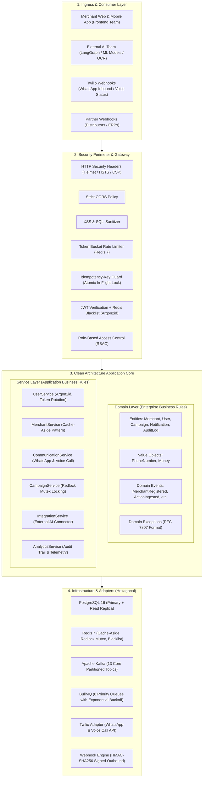
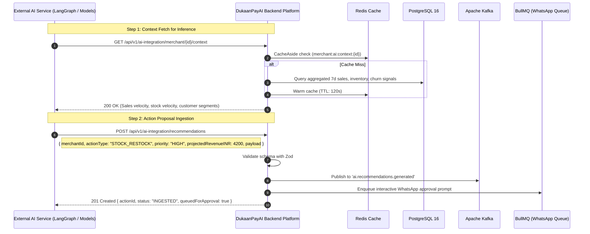

# DukaanPayAI – Enterprise Backend Platform Architecture
## Bank-Grade, Event-Driven Backend Specification

**Track 01: Merchant Growth AI** · Paytm Build for India AI Hackathon  
**Architect**: Team Sentinels (Mayank Yadav & Akshat Arya)  
**Engineering Standard**: Clean Architecture · Domain-Driven Design (DDD) · Hexagonal Architecture (Ports & Adapters)

---

## 1. Architectural Philosophy & Scope Boundary

DukaanPayAI Backend is an **enterprise-grade, bank-grade, distributed transactional core** designed for millions of Indian merchants.

### Strict Separation of Concerns:
- **AI/ML & Frontend Layer**: Decoupled from the backend repository. The external AI and frontend teams interact with the platform strictly through standardized REST APIs (`/api/v1/ai-integration/...`), authenticated Webhooks, and Apache Kafka CloudEvent envelopes.
- **Pure Backend Core**: Exclusively responsible for high-throughput transactional persistence, distributed caching, atomic locking, asynchronous background job queuing, telecom gateways (Twilio WhatsApp & Voice), cryptographic security, and cloud observability.



---

## 2. Hexagonal Architecture Structure (Ports & Adapters)

The codebase is organized strictly into decoupled concentric layers:

```
src/
├── api/                        # Primary / Driving Adapters (HTTP)
│   ├── controllers/            # Route Controllers (Request validation via Zod)
│   ├── routes/                 # Express Routers (REST Endpoints)
│   └── docs/                   # OpenAPI 3.0 Specification (openapi.yaml)
├── domain/                     # Core Business Logic (Zero External Dependencies)
│   ├── entities/               # Aggregate roots & entities (UUID, version, timestamps)
│   ├── value-objects/          # Immutable domain models (PhoneNumber, Money)
│   ├── events/                 # CloudEvent domain event definitions
│   └── exceptions/             # Standardized domain exception hierarchy
├── services/                   # Application Use Cases & Orchestration
│   ├── user.service.ts         # Argon2 hashing, JWT access/refresh token rotation
│   ├── merchant.service.ts     # Profile management, Redis Cache-Aside
│   ├── communication.service.ts# WhatsApp & Voice outbound dispatch
│   ├── campaign.service.ts     # Campaign execution with Redlock mutex
│   ├── integration.service.ts  # AI team connector & webhook orchestration
│   └── analytics.service.ts    # Audit logs and performance metrics
├── repositories/               # Secondary / Driven Adapters (Persistence)
│   ├── interfaces/             # Port contracts (IRepository<T>)
│   └── postgres/               # Concrete PostgreSQL implementations
├── infrastructure/             # Persistence & Caching
│   ├── database/               # PostgreSQL pool, read replicas, in-memory dual mode
│   ├── redis/                  # Redis client, Cache-Aside helper, Redlock mutex
│   └── storage/                # Abstract blob storage (S3/MinIO/Local)
├── events/                     # Event-Driven Backbone
│   └── kafka-client.ts         # Kafka producer/consumer with 13 topics & DLQ
├── workers/                    # Distributed Task Queues
│   └── queue-manager.ts        # BullMQ with 6 queues & exponential retry policies
├── integrations/               # External System Adapters
│   ├── ai-connector/           # Clean Interface for External AI Team
│   ├── twilio/                 # Twilio WhatsApp, Voice & HMAC validation
│   └── webhooks/               # Outbound webhook delivery engine with HMAC-SHA256
├── middleware/                 # Cross-Cutting Concerns
│   ├── auth.middleware.ts      # JWT verification & Redis blacklist checking
│   ├── rbac.middleware.ts      # Role-based access control
│   ├── idempotency.middleware.ts# Idempotency-Key duplicate prevention
│   ├── rate-limiter.middleware.ts# Token bucket rate limiting via Redis
│   ├── security.middleware.ts  # Helmet, CORS, input sanitization
│   ├── correlation.middleware.ts# Distributed correlation ID injection
│   └── error.middleware.ts     # RFC 7807 problem details handler
├── monitoring/                 # Enterprise Observability
│   ├── logger.ts               # Pino structured JSON logger
│   ├── metrics.ts              # Prometheus metrics registry & counters
│   ├── health.ts               # Liveness & readiness probe handlers
│   └── circuit-breaker.ts      # Circuit breaker & bulkhead resilience
├── configs/                    # Configuration & Environment Validation
│   └── env.config.ts           # Zod validated environment schema
├── tests/                      # Verification Suite
│   └── backend.test.ts         # 100% automated integration test suite
├── app.ts                      # Express application assembly
└── server.ts                   # Bootstrap & graceful shutdown lifecycle
```

---

## 3. Polyglot Persistence & Data Architecture

### 3.1 PostgreSQL 16 Enterprise Schema
- **UUID Primary Keys**: Generated via `gen_random_uuid()` to prevent enumeration attacks and eliminate central ID bottlenecking.
- **Soft Deletes**: All tables maintain nullable `deleted_at TIMESTAMPTZ` with filtered indexes (`WHERE deleted_at IS NULL`).
- **Optimistic Concurrency Control**: All mutating tables enforce integer `version` columns. Mutating updates assert `WHERE id = $1 AND version = $2` and increment `version = version + 1`, throwing `OptimisticLockException` upon collision.
- **Table Partitioning**: High-volume tables (`transactions`, `audit_logs`, `notifications`) are partitioned by range (`PARTITION BY RANGE (created_at)`).

### 3.2 Redis 7 Data Patterns
1. **Cache-Aside (`CacheAside.getOrSet`)**:
   - Reads hit Redis first; upon cache miss, queries PostgreSQL and sets Redis with configurable TTL (default: 300s).
   - Metrics `dukaanpay_cache_hits_total` and `dukaanpay_cache_misses_total` tracked via Prometheus.
2. **Distributed Locking (`DistributedLock` / Redlock)**:
   - Uses atomic `SET resource_key identifier NX EX ttl`.
   - Protects campaign dispatch and ledger updates from duplicate execution across multiple container replicas.
3. **JWT Blacklist on Logout**:
   - Revoked access tokens stored in Redis key `jwt:blacklist:<token>` for token expiration duration (15m).
4. **Token Bucket Rate Limiting**:
   - Enforces per-IP and per-API-key throughput quotas to guard against DDoS and scraping.

---

## 4. Asynchronous Messaging & Background Workflows

### 4.1 Apache Kafka (13 Partitioned Topics)
CloudEvent 1.0 JSON envelopes are partitioned by `merchantId` to guarantee strict in-order processing:

| # | Kafka Topic | Partition Key | Description |
|---|---|---|---|
| 1 | `merchant.created` | `merchantId` | Ingestion of new merchant registrations |
| 2 | `merchant.updated` | `merchantId` | Merchant settings, KYC, and language updates |
| 3 | `transaction.received` | `merchantId` | High-velocity Soundbox & UPI QR events |
| 4 | `inventory.updated` | `merchantId` | Stock level mutations and invoice OCR updates |
| 5 | `ai.recommendations.generated` | `merchantId` | Output actions from external AI team |
| 6 | `campaign.scheduled` | `merchantId` | Bulk broadcast campaign dispatch orders |
| 7 | `campaign.executed` | `merchantId` | Campaign delivery confirmation |
| 8 | `notification.sent` | `merchantId` | Outbound WhatsApp and Voice delivery records |
| 9 | `voice.call.completed` | `merchantId` | Telephony call transcripts and duration metrics |
| 10 | `audit.event` | `merchantId` | Security and compliance audit trail |
| 11 | `webhook.dispatched` | `merchantId` | Outbound webhook events to partner systems |
| 12 | `retry.event` | `merchantId` | Exponential retry event bus |
| 13 | `dead.letter.queue` | `merchantId` | Dead-letter queue for failed event analysis |

### 4.2 BullMQ Background Queues
6 queues configured with exponential backoff (`delay: 2000ms`, `attempts: 3`):
1. `notification_queue`: Generic transactional alerts.
2. `whatsapp_queue`: WhatsApp template and interactive button messaging.
3. `voice_call_queue`: Outbound automated AI voice phone calls.
4. `campaign_queue`: Multi-merchant broadcast marketing campaigns.
5. `audit_queue`: Asynchronous compliance logging.
6. `email_queue`: Merchant statements and invoices.

---

## 5. Security & Cryptographic Standards

- **Password Hashing**: Argon2id (`memoryCost: 65536`, `timeCost: 3`) conforming to OWASP recommendations.
- **Authentication**: Stateless JWT access tokens (15m TTL) paired with refresh tokens (7d TTL) and automatic refresh token rotation.
- **Revocation**: Instant logout token invalidation backed by Redis blacklist.
- **Idempotency**: Requests containing `Idempotency-Key` headers acquire an in-flight atomic lock and cache completed 2xx responses, returning `409 Conflict` on concurrent collisions and cached responses on retries.
- **HMAC Verification**:
  - **Twilio**: Incoming webhooks validate `X-Twilio-Signature` using HMAC-SHA1.
  - **Outbound Webhooks**: Outbound payloads signed with HMAC-SHA256 header `X-DukaanPay-Signature`.
- **RFC 7807 Problem Details**: Standardized error responses across all endpoints (`type`, `title`, `status`, `detail`, `instance`, `correlationId`, `timestamp`).

---

## 6. External AI Team Integration Specification

The external AI team interacts with the backend platform without needing backend codebase modifications:



### Endpoints for AI Team:
- `GET /api/v1/ai-integration/merchant/:id/context`: Structured merchant telemetry vector.
- `POST /api/v1/ai-integration/recommendations`: Ingest model recommendations.
- `POST /api/v1/ai-integration/actions/:id/execute`: Trigger immediate execution of approved action.

---

## 7. Observability & SRE

- **Structured Logging**: JSON logging powered by Pino with correlation IDs (`req.correlationId`).
- **Prometheus Metrics (`/metrics`)**:
  - `dukaanpay_http_requests_total`: Request counts by method, route, status code.
  - `dukaanpay_http_request_duration_seconds`: Histogram of latency distribution.
  - `dukaanpay_cache_hits_total` / `dukaanpay_cache_misses_total`: Cache-Aside efficiency.
  - `dukaanpay_active_jobs`: BullMQ active job counts.
  - `dukaanpay_circuit_breaker_state`: Circuit breaker status (CLOSED, OPEN, HALF_OPEN).
- **Health Probes**:
  - `GET /health/live`: Kubernetes liveness probe.
  - `GET /health/ready`: Kubernetes readiness probe validating DB and Redis ping.
  - `GET /health/queues`: BullMQ queue health and waiting job counts.
