# 🏪 DukaanPay AI — Autonomous Kirana Growth & CFO Platform

> **Paytm Build for India AI Hackathon · Track 01: Merchant Growth AI**  
> *Transforming the ubiquitous Paytm Soundbox into an Autonomous 24/7 AI Store Operating Partner, Virtual CA & Wealth Advisor for Bharat’s 13 Million Retail Merchants.*

[](https://dukaanpayai-paytm-hackathon.onrender.com)
[](https://drive.google.com/drive/folders/1Kgnw95GOTJ4w2EmcUGzdjWV706LuykhY)
[](https://nextjs.org)
[](https://groq.com)
[](LICENSE)

---

## 📌 Important Hackathon Links

| Resource | Direct Link |
| :--- | :--- |
| 🌐 **Live Production Application** | [https://dukaanpayai-paytm-hackathon.onrender.com](https://dukaanpayai-paytm-hackathon.onrender.com) |
| 🎥 **Video Pitch & Walkthrough Folder** | [https://drive.google.com/drive/folders/1Kgnw95GOTJ4w2EmcUGzdjWV706LuykhY](https://drive.google.com/drive/folders/1Kgnw95GOTJ4w2EmcUGzdjWV706LuykhY) |
| 📊 **Interactive Merchant Dashboard** | [https://dukaanpayai-paytm-hackathon.onrender.com/dashboard](https://dukaanpayai-paytm-hackathon.onrender.com/dashboard) |
| 📑 **Technical Approach Paper** | [`APPROACH.md`](./APPROACH.md) |
| 🏗️ **Backend Enterprise Architecture** | [`backend/ARCHITECTURE.md`](./backend/ARCHITECTURE.md) |

---

## 🎯 Executive Summary & Mission

India's retail economy is powered by **13 million+ micro-merchants (Kirana stores)** who process over $800 Billion in annual trade. While Paytm revolutionized payments through QR codes and the 4G Soundbox, merchants still manage daily operations manually on scraps of paper or mental notes. 

Existing retail software (Vyapar, Khatabook, Marg) fails at scale because **merchants do not have time to sit at a laptop or type data into a mobile screen during peak counter rushes**.

**DukaanPay AI** bridges this critical gap by converting the existing **Paytm Soundbox 4G hardware** into an ambient, zero-touch **AI Chief Operating Officer (Voice COO)**, **Computer Vision Shelf Auditor**, and **Virtual Chartered Accountant (Virtual CA)**. The merchant speaks naturally in Hindi or English, uploads phone camera pictures of shelves or paper ledgers via WhatsApp, and receives real-time business intelligence without typing a single character.

---

## 🚨 The 4 Critical Kirana Problems Solved

```
┌────────────────────────────────────────────────────────────────────────────────────────┐
│                              THE 4 KIRANA MARGIN KILLERS                                │
├──────────────────────────┬──────────────────────────┬──────────────────────────────────┤
│ 1. Khata (Udhaar) Leak   │ ₹4,250 - ₹12,000 pending │ Forgotten debts, delayed manual  │
│                          │ uncollected credit       │ follow-ups, lost customer trust  │
├──────────────────────────┼──────────────────────────┼──────────────────────────────────┤
│ 2. Distributor Overcharge│ 4% - 8% hidden margin    │ Invoice price creeping over      │
│                          │ leakage                  │ agreed contract rate-cards       │
├──────────────────────────┼──────────────────────────┼──────────────────────────────────┤
│ 3. Peak-Hour Stockouts   │ ₹2,300+ lost sales / day │ Missing inventory during rushes; │
│                          │ on high-velocity items   │ blind reordering                 │
├──────────────────────────┼──────────────────────────┼──────────────────────────────────┤
│ 4. Tax & Yield Ignorance │ ₹75,180 / year overpaid  │ Ignoring Section 44AD digital    │
│                          │ in taxes & idle float    │ tax relief & overnight yield     │
└──────────────────────────┴──────────────────────────┴──────────────────────────────────┘
```

---

## 💡 Core Innovations & Capabilities

### 1. 🎙️ Autonomous Voice COO & Bidirectional Phone Calling
* **Conversational Indic IVR**: Merchants can call or receive proactive phone calls from DukaanPay AI (`+1 724 538 7484`). Powered by Twilio Voice and Groq LPU Indic models (`qwen/qwen3.8-27b`), the agent conducts fluid, live spoken conversations in natural Hindi/Hinglish.
* **Proactive Daily Briefings**: Automated briefings at 07:30 AM (Morning prep), 12:30 PM (Mid-day restock), 05:30 PM (Evening peak footfall surge), and 10:00 PM (Night closing & Paytm bank settlement).
* **What-If Simulations**: Speaks answers to questions like *"Agar Maggi ke 50 packet mangwaun toh kitne din me bikege?"* based on calculated depletion velocity.

### 2. 📸 Multimodal Vision & Shelf Auditing (YOLOv10 / Florence-2)
* **Instant WhatsApp Shelf Scans**: Merchants snap a photo of their physical racks.
* **Automated Recognition**: Detects item counts across categories (Snacks, Dairy, Staples, Beverages), flags empty shelf slots, identifies critical stockout thresholds, and drafts 1-tap WhatsApp supplier Purchase Orders (POs).

### 3. 🧾 Bahi-Khata & Invoice Rate-Audit OCR (PaddleOCR + Qwen-2-VL)
* **Handwritten Bahi-Khata OCR**: Decodes handwritten customer credit records, classifies aging risk (e.g., Tiwari Ji: ₹1,450, 24 days overdue), and generates 1-click WhatsApp payment reminders with dynamic Paytm UPI QR codes.
* **Distributor Invoice Rate-Audit**: Audits incoming supplier invoices against agreed rate cards. Catches hidden distributor rate creeping (e.g. ₹480 overcharge on Surf Excel & Lifebuoy) and auto-generates a ready-to-send WhatsApp Debit Note.

### 4. 💼 Interactive Virtual CA & Wealth Advisor (Section 44AD)
* **Presumptive Taxation Optimization**: Computes tax under Section 44AD (6% deemed profit on digital UPI vs 8% on cash turnover), saving ₹36,800 annually.
* **1% GST Composition Relief**: Automatically calculates eligibility for retail composition scheme under ₹1.5 Cr turnover.
* **Daily Cash Float Sweep**: Recommends sweeping daily closing float into overnight liquid funds (6.8% yield), unlocking ₹75,180 in total annual merchant financial gains.
* **Interactive Dashboard Chatbot**: Complete with speech synthesis (`window.speechSynthesis`) read-aloud and real-time Groq financial reasoning.

---

## 🏛️ System Architecture

```mermaid
flowchart TD
    subgraph MerchantSurfaces["1. Merchant Interaction Surfaces"]
        Soundbox["Paytm Soundbox 4G (Voice Broadcast)"]
        WhatsApp["WhatsApp Bot (Text / Photos / Audio)"]
        VoiceCall["Bidirectional Phone Call (+1-724-538-7484)"]
        WebDash["Interactive Merchant Web Dashboard"]
    end

    subgraph IngressGateway["2. Ingress, Security & Tunneling"]
        Twilio["Twilio Communications Gateway"]
        Ngrok["Ngrok Secure VoLTE/Webhook Tunnel"]
        RenderLoad["Render Cloud HTTP Gateway"]
    end

    subgraph AgentCore["3. Autonomous Agentic Core (Groq LPU Cloud)"]
        Orchestrator["Master Orchestrator Agent"]
        VoiceCOO["Voice COO Indic Engine (qwen/qwen3.8-27b)"]
        VirtualCA["Virtual CA & Tax Advisor (openai/gpt-oss-120b)"]
        VisionAgent["Shelf Vision Engine (YOLOv10 / Florence-2)"]
        OCRAgent["Invoice & Bahi-Khata OCR (PaddleOCR / Qwen-2-VL)"]
    end

    subgraph MLForecasting["4. Predictive ML Pipelines"]
        Prophet["Facebook Prophet (Hourly Demand Curves)"]
        XGBoost["XGBoost (Footfall Peak Detection)"]
        RFM["Scikit-Learn (RFM Shopper Churn Ledger)"]
    end

    subgraph BackendEnterprise["5. Clean Architecture Backend Core"]
        Express["Express.js Microservices Layer"]
        InMemDB["High-Performance In-Memory DB / PostgreSQL 16"]
        Redis["Redis 7 Distributed Cache & Rate Limiter"]
        KafkaBus["Embedded Event Bus / Apache Kafka"]
        BullMQ["BullMQ Asynchronous Job Queues"]
    end

    MerchantSurfaces --> IngressGateway
    IngressGateway --> AgentCore
    AgentCore --> MLForecasting
    AgentCore --> BackendEnterprise
    BackendEnterprise --> MerchantSurfaces
```



---

## 🛠️ Complete Technology Stack

| Layer | Technologies Used |
| :--- | :--- |
| **Frontend & UI** | Next.js 16.3.5 (Turbopack, App Router), React 19, TypeScript 5, Tailwind CSS 4, Framer Motion, GSAP ScrollTrigger, Recharts, Lucide Icons, Three.js (3D Agent Graph). |
| **High-Speed AI Models** | **Groq LPU Cloud** executing `openai/gpt-oss-120b` (Deep Statutory Tax Reasoning & CA Advisory) and `qwen/qwen3.8-27b` (Sub-second Conversational Indic Hindi/English). |
| **Computer Vision & OCR** | YOLOv10 & Grounding DINO (Shelf Bounding Boxes & Stock Counting), Florence-2 (Multimodal Scene Parsing), PaddleOCR + Qwen-2-VL (Invoice Rate-Audits). |
| **Predictive ML Models** | Facebook Prophet (24-Hour Demand Curve), XGBoost (Peak Queue Rush Detector), Scikit-Learn (RFM Shopper Retention Matrix). |
| **Backend Core** | Node.js, Express.js (Clean Hexagonal Architecture, Ports & Adapters), BullMQ, Argon2id Cryptographic Security, Pino Structured Logging, Zod Validation. |
| **Data & Messaging** | In-Memory Transactional Store, PostgreSQL 16 adapter, Redis 7 caching & distributed locks, Embedded Event Bus / Apache Kafka. |
| **Telecom & Voice** | Twilio Voice API (Indic speech recognition `<Gather>` & TwiML synthesis), Twilio WhatsApp Business API with smart multi-chunking (<1,400 chars). |
| **Container & Cloud** | Multi-Stage Production Dockerfile (`node:20-alpine`), Render Cloud Web Service, Ngrok Secure Tunnel. |

---

## 📊 Grounded Store Telemetry (Laxmi Kirana Store)

To ensure zero hallucinations, all models and calculations operate on a 100% grounded retail knowledge graph:

* **Store**: Laxmi Kirana & General Store (Merchant: Rameshwar Gupta)
* **Location**: Shop 4, Sector 3, Malviya Nagar, Jaipur, Rajasthan (302017)
* **Today's Gross Sales**: ₹18,400 across 142 orders (Paytm QR/UPI: ₹14,200 [77%], Cash: ₹4,200)
* **Yesterday's Gross Sales**: ₹19,850 (Dip due to afternoon 2-4 PM lull and Maggi stockout)
* **Pending Khata Debt**: ₹4,250 across 5 debtors (Tiwari Ji: ₹1,450 [24d overdue], Sharma Ji: ₹1,240 [18d], Verma Ji: ₹850 [12d], Gupta Ji: ₹410 [5d], Sunita Bhabhi: ₹300 [3d])
* **Today's Footfall**: ~158 shoppers (Evening peak rush: 6:00 PM – 8:30 PM with 72 shoppers)
* **Annual Tax Savings**: ₹75,180 (Section 44AD digital turnover relief + GST Composition + Overnight Float Sweep)

---

## ⚡ Quickstart & Local Setup

### 1. Prerequisites
- **Node.js**: `v20.x` or higher
- **Python**: `3.10+` (for ML pipeline)
- **Git** & **npm**

### 2. Clone and Install
```bash
git clone https://github.com/beastzex/DukaanPayAI_Paytm_Hackathon.git
cd DukaanPayAI_Paytm_Hackathon

# Install Frontend & Fullstack dependencies
npm install

# Install Backend Microservice dependencies
cd backend && npm install && cd ..
```

### 3. Environment Variables
Create a `.env` file in the root directory:
```env
# Groq LPU (openai/gpt-oss-120b & qwen/qwen3.8-27b)
GROQ_API_KEY=your_groq_api_key

# Telecom Integration (Twilio Live Account)
TWILIO_ACCOUNT_SID=your_twilio_account_sid
TWILIO_AUTH_TOKEN=your_twilio_auth_token
TWILIO_WHATSAPP_NUMBER=whatsapp:+14155238886
TWILIO_VOICE_NUMBER=+17245387484

# Backend Core API
NEXT_PUBLIC_BACKEND_URL=http://localhost:4000
```

### 4. Run Development Servers
```bash
# Terminal 1: Run Next.js Frontend & Webhook Service (Port 3000)
npm run dev

# Terminal 2: Run Enterprise Express Backend (Port 4000)
cd backend && npm run dev
```

Visit `http://localhost:3000` or `http://localhost:3000/dashboard` in your browser.

---

## 🐳 Production Deployment (Docker & Render)

The project includes a multi-stage, zero-dependency production `Dockerfile` that packages both the Next.js 16 frontend and Express backend into a single container:

```bash
# Build production Docker image
docker build -t dukaanpay-ai .

# Run containerized application
docker run -p 3000:3000 -p 4000:4000 --env-file .env dukaanpay-ai
```

On **Render**, select **Docker Runtime** and deploy directly from `main` branch. The included `start.sh` boots the backend on port 4000 and Next.js on Render's assigned `$PORT`.

---

## 👥 Team Sentinels (Developers & Authors)

* **Mayank Yadav** — Full-Stack Architecture, Agentic AI Engineering, Microservices & Telecom Integration
* **Akshat Arya** — Clean Backend Systems, Cloud Deployment, Financial Modeling & Data Science

---

## 📄 License
This project is licensed under the MIT License — see the [LICENSE](LICENSE) file for details.
